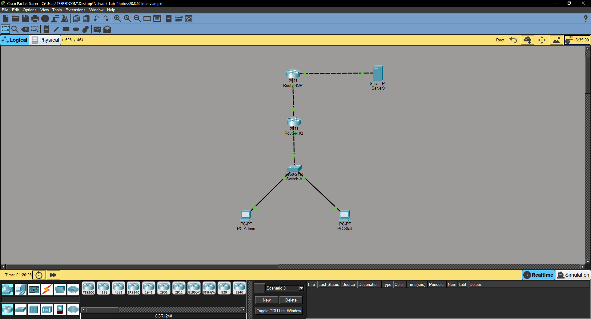

# Lab 01: Inter-VLAN Routing, DHCP, and NAT Overload Setup

## 📌 Project Overview
Lab นี้เป็นการจำลองระบบเครือข่ายองค์กรขนาดเล็กที่ใช้ Cisco Router และ Switch โดยประกอบด้วยการแบ่ง VLAN, การแจก IP แบบอัตโนมัติ (DHCP), การเชื่อมต่อออกอินเทอร์เน็ตผ่าน NAT Overload และการกำหนด Default Route

## 📐 Network Topology

* **VLAN 10:** Admin (`192.168.10.0/24`)
* **VLAN 20:** HR (`192.168.20.0/24`)
* **VLAN 30:** Sales (`192.168.30.0/24`)
* **WAN Link:** `200.1.1.0/30`
* **Internet Server:** `8.8.8.8/24`

## 🛠️ Key Configurations & Concepts Learned
* **Inter-VLAN Routing (Router-on-a-Stick):** ใช้ Sub-interface แยก VLAN บนพอร์ตเดียว
* **DHCP Server:** แจก IP ให้ client แต่ละ VLAN พร้อมเว้นช่วง IP สถิต (`excluded-address`)
* **NAT Overload (PAT):** แปลง Private IP เป็น Public IP ขา WAN โดยใช้ **Wildcard Mask (`0.0.255.255`)** เพื่อคุมทุก VLAN ในบรรทัดเดียว
* **Default Route:** ชี้ `0.0.0.0 0.0.0.0` ออกไปยัง Router-ISP (`200.1.1.2`)

## ✅ Verification
ทดสอบ Ping จาก PC ในวง LAN ไปยัง Server ด้านนอก (`8.8.8.8`) ผลลัพธ์คือการส่งแพ็กเก็ตสำเร็จ 100% (TTL=126)
